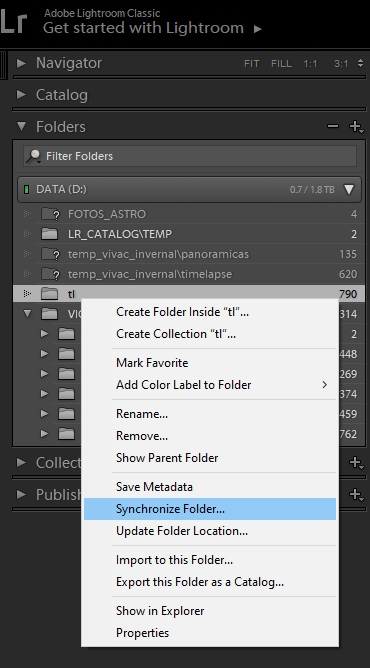
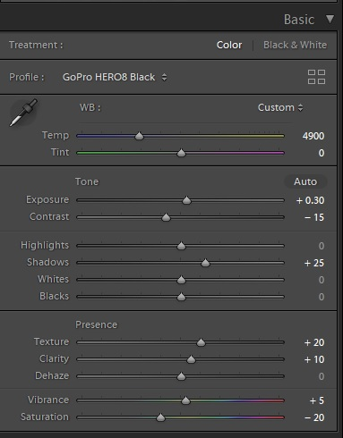
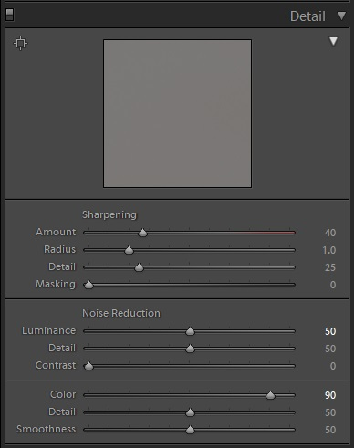
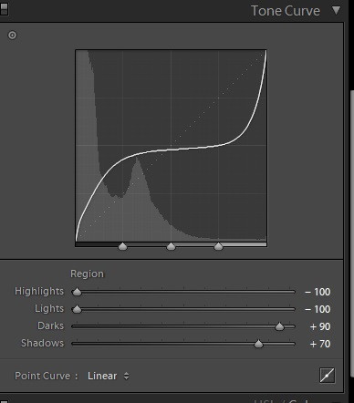
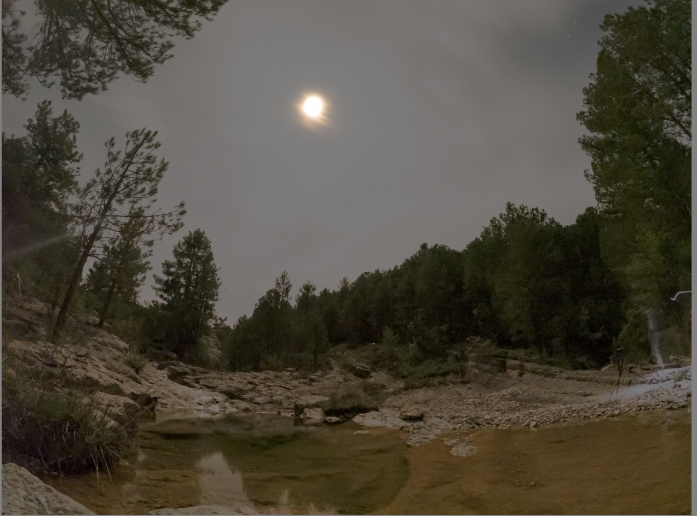
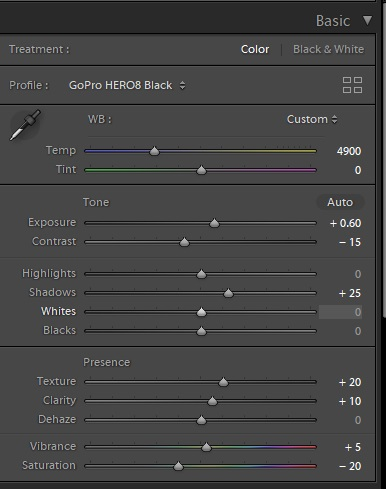
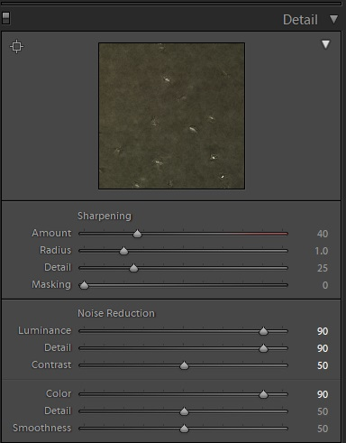
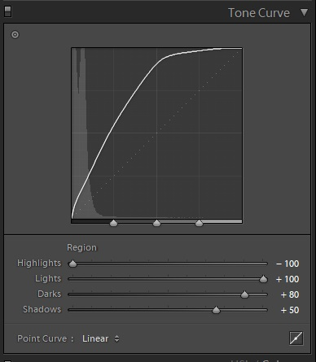
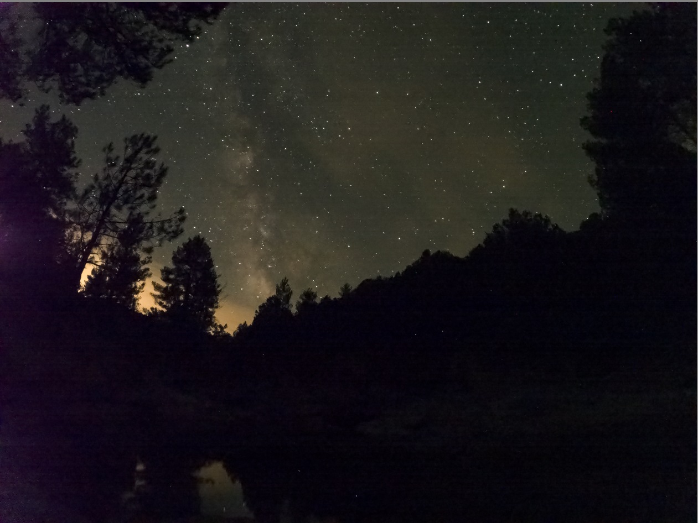

# Lightroom and GoPro

The following is an example that shows a timelapse (nightlapse) where first there is a full moon and progressively the moon is hidden by the mountain, so the light condition changes in an important manner.

It is assumed that the images are taken by GoPro camera in RAW format (GPR) from a configuration similar to:

* Time Lapse => Night lapse
* Lens: Wide
* Interval: Auto
* Format: Photo
* Output: RAW
* Shutter: 30s
* White Balance: Native
* ISO Min: 100
* ISO Max: 800
* Sharpness: Medium
* Color: Flat

Let's divide all the images in three lists

* List A: images having FULL moon
* List B: images having TRANSITION between moon and no moon
* List C: images with NO moon (completely dark)

## Workflow

* Import all images of the nightlapse (GRP format) as DNG files in Lightroom
 
* Adjust the settings for all images in List A and the first image of List B as described in point below "Settings for images with full moon" 

* Adjust the settings for all images of List C and the last of List B as described in point below "Settings for images without moon"

* In Lightroom, go to  *Library* panel and select all images of the timelapse (List A, List B and List c), then Menu Metadata -> "Update DNG previews & Metadata": this operation will update the DNG files with the setting we changed.

* Execute this tool as follows:

`java -jar dng-settings-interpolator-X.X.jar <folder image> <folder backup> -- files <first file of List B> <last file of List b>`

* Once the tool has finished, select the directory in the *Library* panel having the images and select "Synchronize Folder..."
 
 
* Now all the images from List B shows a smooth transition!!

* Create the timelapse using your favourite tool from the list o images !!

# Setting for images with full moon

Settings in *Develop* Panel

   

 

# Setting for images without  moon

Settings in *Develop* Panel

   

 
